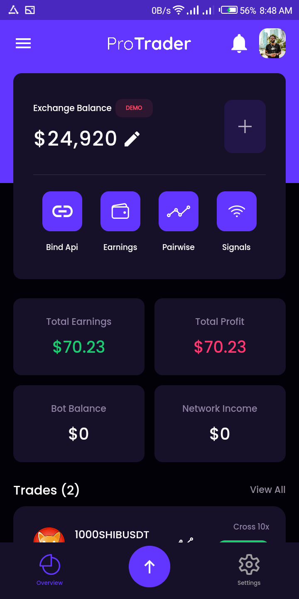
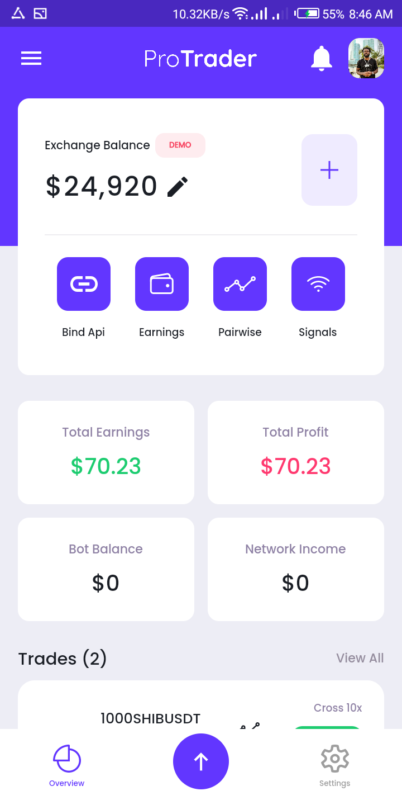

# crypto_payment

This project is a starting point for a Flutter application.

A crypto payment and auto investment platform 

visit website here: https://app.bizzatrader.com/app/dashboard

View app here: https://ui.bizzatrader.com/

about 50 endpoints connected including websockets 

Feauture 

users can activate an automatic trading robot,

users can send and recieve crypto

users can buy and sell their favourite cryptocurrency 

users can switch to light or dark mode 

users can set up 2FA

users can see highest earners and top traders 

referal links and bonuses 

light and dark mode
 

